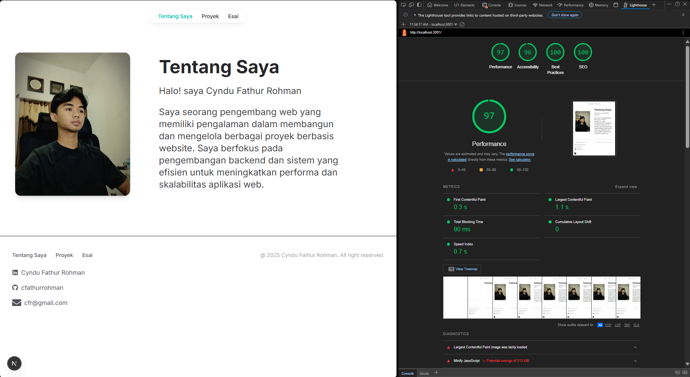

### Tugas 
### Membangun Website Pribadi dengan Next.js (App Router), React, dan Tailwind CSS

#### - Eksplorasi Tailwindcss, kemudian. 
1. Modifikasi halaman "Esai" dengan Grid daftar artikel yang telah ditulis. 

2. Modifikasi halaman “Tentang Saya” Buat tampilan yang menarik

### Membuat Halaman yang SEO-Friendly dengan Next.js
#### - Lakukan pengujian SEO dengan
1.	Gunakan tools seperti Google Search Console untuk memeriksa performa SEO dari suatu website. 

